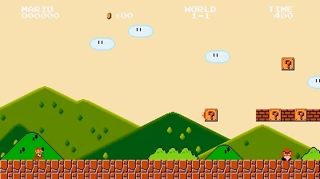

# Maximizando Recompensas em Ambientes Estocásticos: Uma Nova Abordagem de RL no Jogo Mario
Neste blog, mergulhamos no artigo To the Max: Reinventing Reward in Reinforcement Learning.Destacamos a importancia de maximizar a recompensa ...;Reproduzimos os resultados experimentais do artigo .Este blog tem como objetivo fornecer aos pesquisadores e profissionais (1) uma melhor compreensão do aprendizado por reforço seguro em termos de otimização restrita e (2) como as funções de recompensa penalizadas podem ser efetivamente usadas para treinar uma política robusta.

# Introduction to Safe Reinforcement Learning

